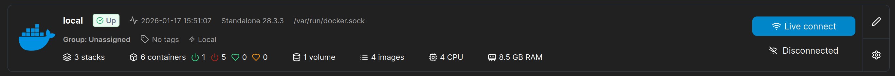
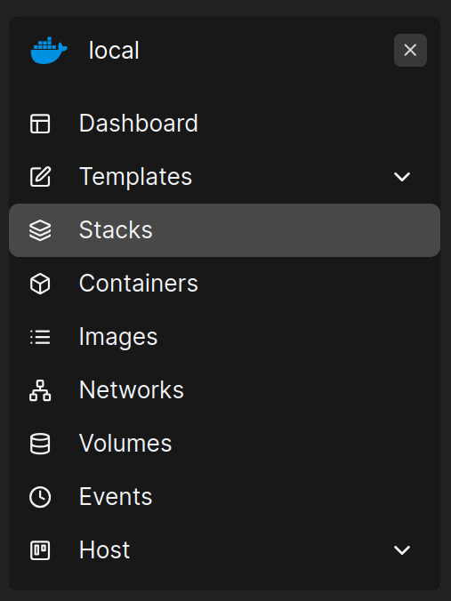
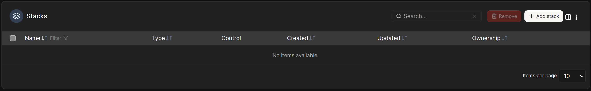
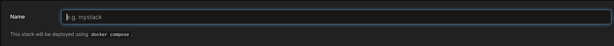
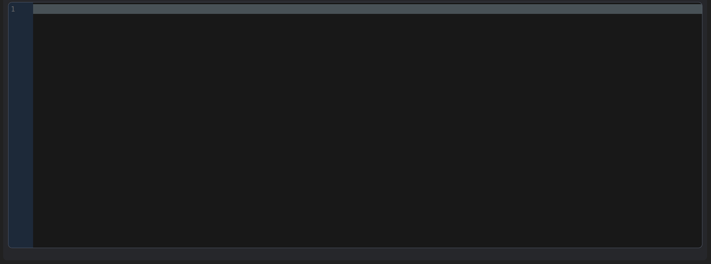
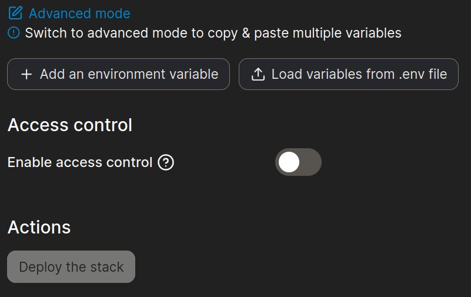
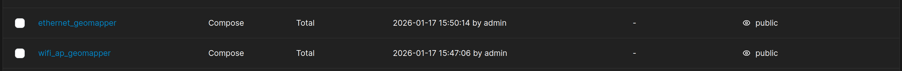
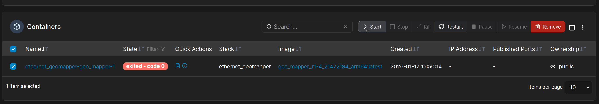
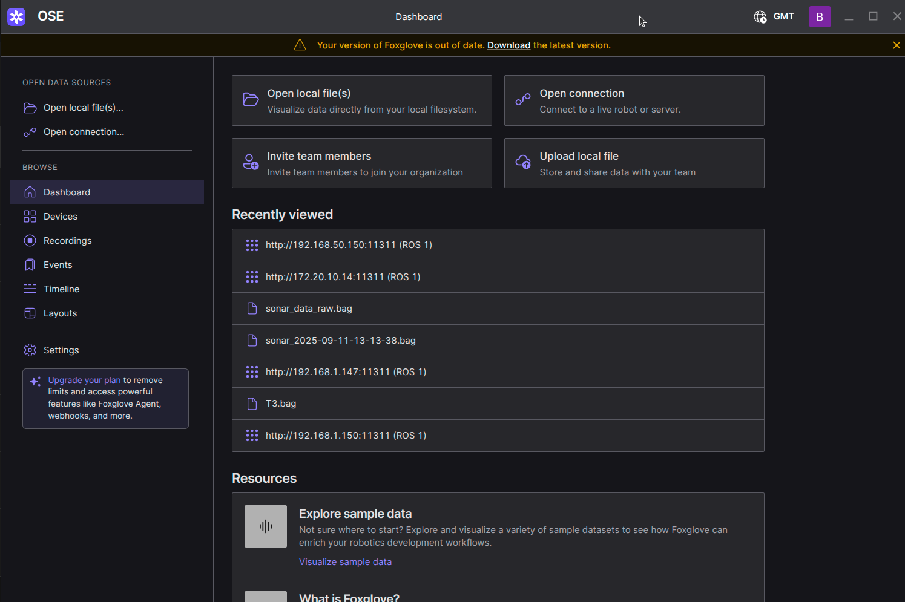
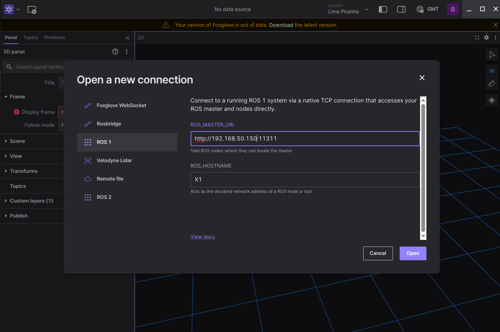

# GeoMapper - Docker Instructions

- [Introduction](#introduction)
- [General points](#general-points)
- [Installing the docker stack](#installing-the-docker-stack)
- [Setting up the system](#setting-up-the-system)
- [Setting up Portainer](#setting-up-portainer)
- [Triggering stack - CLI](#triggering-stack---cli)
- [Triggering Stack - Portainer](#triggering-stack---portainer)
- [Data output](#data-output)
- [Live Visualisation](#live-visualisation)

## Introduction

This markdown file provides information regarding the setup and usage of the GeoMapper OEM docker image.

## General points

- IP address:
  - The IP address of your systems Ethernet end point MUST be `192.168.5.150`
  - Should you require a different IP address, please contact Osprey Systems Engineering Ltd for a custom installation.

- Architecture:
  - The user will be provided with the docker image compiled for the target architecture, ARM64 or AMD64.
  - The target architecture must be communicated to Osprey Systems Engineering at PO.

## Installing the docker stack

Docker must be installed on the target machine, the installation of which is beyond the scope of this document. However, straightforward and comprehensive instructions can be found here:

https://docs.docker.com/engine/install/

The docker image will be provided as a `.tar` file, for example:

```text
geo_mapper_r1-4_sn-2-147-194_x64.tar
```

Transfer this file to the target computer. Then open a terminal session and load the image with the following commands:

```bash
sudo chmod +777 geo_mapper_r1-4_sn-2-147-194_x64.tar
sudo docker image load -i geo_mapper_r1-4_sn-2-147-194_x64.tar
```

Once this has been completed, the `.tar` file can be removed to save disk space.

## Setting up the system

A `docker-compose.yml` file will be provided along with the tar file, which is used to bring up the GeoMapper docker container.

A data folder is specified in the `docker-compose.yml` file, which will create a docker volume for output data storage. This is specified at the bottom of the `docker-compose.yml` file. Should you wish to change the path, this is where it should be changed.

```yaml
volumes:
  - "/dev:/dev"
  - "/home/cm5/GeoMapper/data:/opt/lidar_ws/src/FL/PCD"
```

Adjust the `/home/cm5/GeoMapper/data:` portion to the desired path.

## Setting up Portainer

Installation of Portainer is beyond the scope of this document, however the online instructions are both straightforward and comprehensive:

https://docs.portainer.io/start/install-ce/server/docker

Once the docker image is uploaded to the system, as described earlier, the user can set up a container through the Portainer interface. This will give a GUI which can be used to start, stop and inspect the GeoMapper logs.

To set up Portainer for this, open the Portainer web browser at:

```text
https://localhost:9443
```

A local account will need to be set up the first time Portainer is used.

Once set up, open Portainer and navigate to:

```text
Local → Stacks
```





Click on the `+ Add stack` icon on the top right.



Give the stack an appropriate name, for example:

```text
geomapper_portainer
```



Copy the contents of the `docker-compose.yml` file into the text box.



De-select Access Control and click the `Deploy the stack` button.



The GeoMapper container will start when the stack is first deployed. See the section titled `Triggering stack - Portainer` for instructions to bring it down.

## Triggering stack - CLI

To trigger GeoMapper through the CLI, run the following command from the path of the `docker-compose.yml` file:

```bash
sudo docker compose up
```

Should the user wish to run this command detached, run the following:

```bash
sudo docker compose up -d
```

When a survey has been completed, and the user wishes to bring GeoMapper down and save the output data, either press `Ctrl+C` in the terminal session if not running in detached mode, or run the following command in the location of the `docker-compose.yml` file:

```bash
sudo docker compose down
```

## Triggering Stack - Portainer

In order to start and stop the GeoMapper docker container using Portainer, log into Portainer and navigate to `Stacks`.


Here, the stack that was created previously will be visible.



Double click on the appropriate stack to move to container view. Select the container and click the `Start` button.

GeoMapper is now active. Ensure the device is steady for at least 3 seconds to establish good IMU offset calibration and a good initial starting point cloud, then the user is free to move around the environment.



When finished, select the container again and click the stop icon.

## Data output

When the GeoMapper docker container is brought down, it will save the output point cloud to the volume specified in the `docker-compose.yml` file.

The file will be titled:

```text
scans.pcd
```

This file will overwrite on subsequent scans.

## Live Visualisation

Once a mapping session is running, the live output can be visualised through Foxglove Studio.

GeoMapper utilises ROS for the middleware, so it is also possible to visualise this data using RViz, however this is outside the scope of this document.

Foxglove Studio is a robotics and data visualisation tool compatible with Linux, macOS and Windows. It can be downloaded from:

https://foxglove.dev/download

Once installed, and a mapping session is active, open Foxglove Studio.

If this is the first time the application has been opened, a free account will need to be created.

Once set up:
1. Open the application
2. Click `Open Connection` in the top left
3. Select `ROS1`
4. Edit the localhost text to the LAN address used by the GeoMapper LiDAR host

```text
http://192.168.5.150:11311
```





Once connected, click the 3D visualisation icon on the top left / middle of the screen. This will open a panel for 3D visualisation and should enable the correct TF frames.

In the drop down menus on the left hand side:
1. Click the eye icon of `cloud_registered`
2. Click the text `cloud_registered`
3. Enter an appropriate decay time

`100 seconds` is recommended, but this number is theoretically unlimited.

It should be noted that visualising many millions of points in real time with larger decay times may cause the visualising computer to slow down.

The user can drag, rotate and zoom in and out on the 3D visualisation.

When finished, exit the application as normal. Settings will remain persistent.